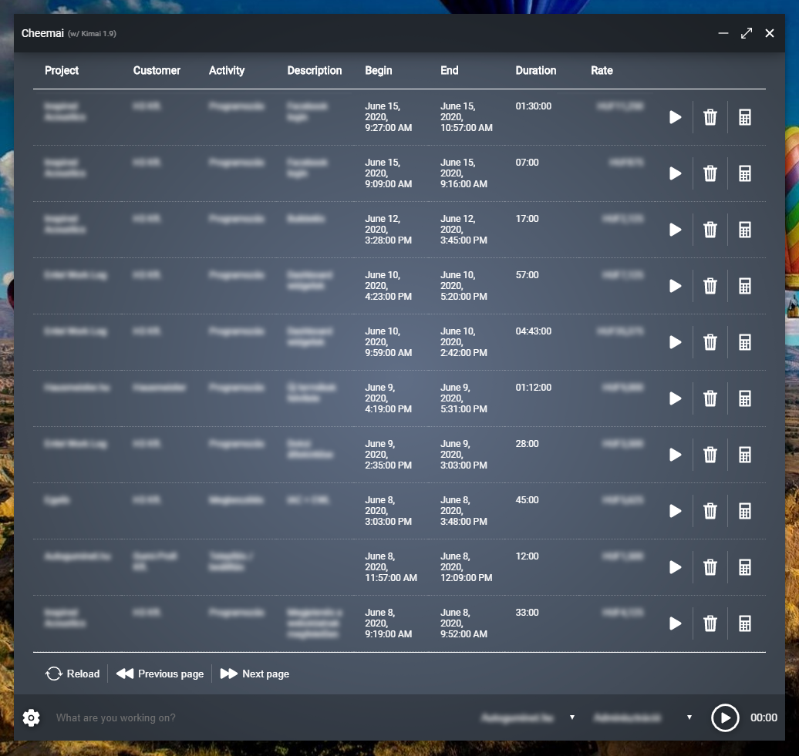

# Cheemai

> Native client for the Kimai platform



#### Build Setup

``` bash
# install dependencies
npm install

# serve with hot reload at localhost:9080
npm run dev

# build electron application for production
npm run build
```

### Platforms

At the moment the app has been built and tested on windows. In the near future I'll build and test the OSX distributable 
as well. In the meantime, you're free to build your very own binary for your OS of choice.

* [Windows Installer](https://www.szabogabor.net/download/Cheemai-latest-setup.exe)

### Features

* Create new timesheet entry
* Continue timesheet entry (with the same description, project and activity) by clicking on "Continue" button or doubleclicking on the row
* Modify description, project and activity during recording
* Delete timesheet entry
* Browse through existing entries
* Change language (currently available: English & Hungarian)

### Features to come

* Edit timesheet entries
* List filtering, ordering
* A better presentation of timesheet entries
* Create customers, projects & activities
* Statistics about working hours & revenues
* Auto-update

### Credits

 * Thanks to [ionicons.com](http://ionicons.com/) for the awesome iconpack they crafted.

---

This project was generated with [electron-vue](https://github.com/SimulatedGREG/electron-vue)@[45a3e22](https://github.com/SimulatedGREG/electron-vue/tree/45a3e224e7bb8fc71909021ccfdcfec0f461f634) using [vue-cli](https://github.com/vuejs/vue-cli). Documentation about the original structure can be found [here](https://simulatedgreg.gitbooks.io/electron-vue/content/index.html).
